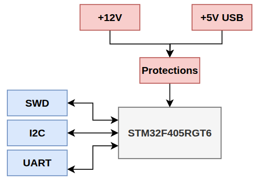
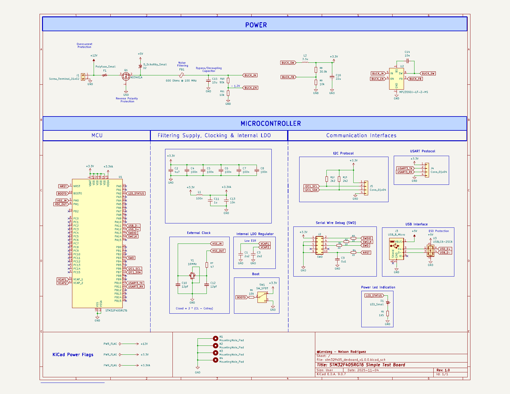

# STM32F405RGT6 Dev Board

 

## Description

This project is a minimal STM32F4-based development board designed as a firmware development, testing, and validation platform. The hardware provides a stable and standards-compliant microcontroller environment, including protected power entry, efficient voltage regulation, proper clocking, and full debug access via the Serial Wire Debug interface. The design intentionally avoids application-specific peripherals and extensive GPIO breakout, instead exposing only essential system and communication interfaces—such as SWD and selected serial interfaces (e.g., UART and I²C)—required for low-level firmware bring-up, internal peripheral driver testing, and evaluation of different firmware architectures. The USB connector is used exclusively as a power input source.

## Specifications

| Specification            | Description                                |
| ------------------------ | ------------------------------------------ |
| Communication Interfaces | SWD, I2C, USART                            |
| Power Methods            | USB, External DC                           |
| Power Protections        | Overcurrent, Overvoltage, Reverse Polarity |
| MCU                      | STM32F405RGT6                              |

## Block Diagram

## Schematic

