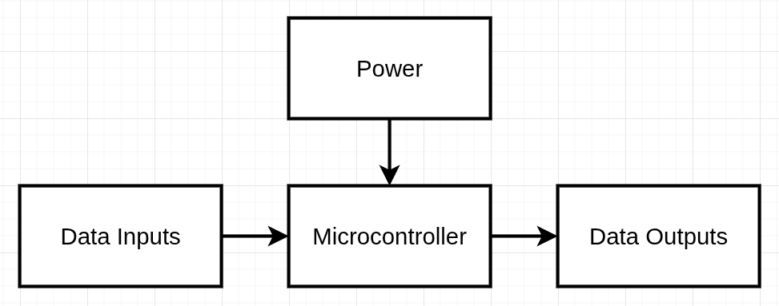
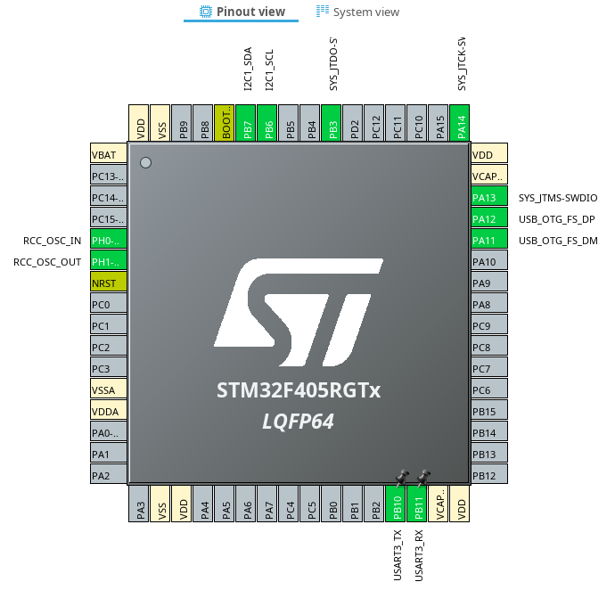

# STM32F405RGT6 Simple Test Board 

> 🚧 **In Progress:** This design is under active development. Updates and test results will be added soon.

## Architecture

## Design

For this simple test board, the pins and peripherals that will be used are:
- Serial Wire Debug
- High Speed External Crystal Oscillator
- USB Differential Pair
- I2C
- UART

| Subsystem     | Component               |
| ------------- | ----------------------- |
| MCU           | STM32F405RGT6           |
| Power         | MP2359DJ                |
| USB           | USB Type C              |
| Debug         | SWD (Serial Wire Debug) |
| Clock         | 8 MHz Crystal           |
| Communication | I2C, UART               |

